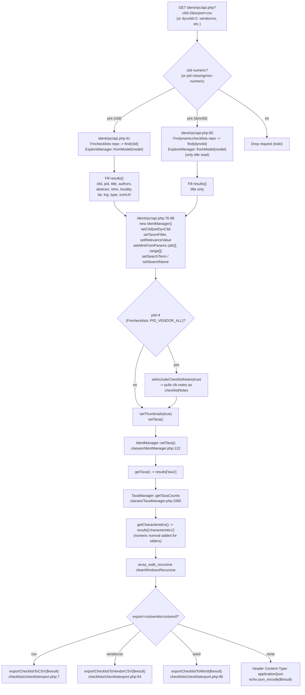

# `ident/rpc/api.php` Data Flow to CSV Export

This file documents how a request to `ident/rpc/api.php` with a `clid` or `dynclid` parameter (and
`export=csv` or `export=vendorcsv`) is processed from initial controller dispatch through to the
final CSV file being streamed back to the browser.

The two paths share the request-handling wrapper at the top and bottom of `ident/rpc/api.php` and
share `IdentManager::setTaxa()` for taxon retrieval. They diverge in:

- Which Doctrine repository hydrates the checklist metadata (the `if (clid)` / `elseif (dynclid)`
  block at `ident/rpc/api.php:41-74`).
- Which checklist-taxalink join `setTaxa()` builds (`Fmchklsttaxalink` vs `Fmdyncltaxalink` at
  `classes/IdentManager.php:237-283`).
- Whether `checklistNotes` (Grow Native vendor, `pid=4`) are pulled for the CSV.

## Request entry: `ident/rpc/api.php`

```php
if (
  (
    array_key_exists("clid", $_GET) &&
    is_numeric($_GET["clid"]) &&
    (!array_key_exists("pid", $_GET) || is_numeric($_GET["pid"]))
  )
  || (array_key_exists("dynclid", $_GET) && is_numeric($_GET["dynclid"]))
) {
  $result = get_data($_GET);
} else {
  // todo: generate error or redirect
}
```

The dispatch accepts `clid` (optionally with `pid`) **or** `dynclid`. For the CSV path the
caller also passes `export=csv` or `export=vendorcsv`, which is checked after `get_data()`.

## `get_data($params)` — shared controller

`get_data()` (`ident/rpc/api.php:36`) does two jobs:

1. Hydrate checklist-level metadata (title, authors, abstract, locality, lat/lng, type, iconUrl)
   from the appropriate Doctrine entity.
2. Build an `IdentManager`, configure it from `$_GET`, run `setTaxa()`, attach taxa + characteristics
   + counts to the `$results` array.

It always returns the same shape (`taxa`, `totals`, `characteristics`, plus `clid`/`dynclid`/`pid`/
`title`/etc.). The shape is consumed by either the JSON branch or the CSV export branch.

## Shared Flowchart



## `clid=2` Path

### Metadata hydration

`ident/rpc/api.php:41-63` runs the `clid` branch:

- `Fmchecklists` entity (`models/Fmchecklists.php`) is fetched by primary key 2.
- `ExploreManager::fromModel($model)` (`classes/ExploreManager.php:28`) wraps the Doctrine entity.
- All metadata getters are called on the wrapper: `getClid`, `getPid`, `getTitle`, `getIntro`,
  `getIconUrl`, `getAuthors`, `getAbstract`, `getLatcentroid`, `getLongcentroid`, `getLocality`,
  `getType`. Note that `getTitle()` and `getIntro()` swap the underlying `name`/`title` columns
  (`classes/ExploreManager.php:42-47`).
- If `pid` is supplied, `Fmprojects` is also fetched and `project.getProjname()` populates
  `results['projName']`.

### `IdentManager` configuration

At `ident/rpc/api.php:76-81`:

- `setClid(2)` stores `clid = 2` on the manager.
- `setTaxonFilter`, `setRelevanceValue`, `setAttrsFromParams($params)` configure the optional
  characteristic filters and search terms.
- If `pid=4` (`Fmchecklists::$PID_VENDOR_ALL`), `setIncludeChecklistNotes(true)` is called
  (`ident/rpc/api.php:91-94`). This is the only code path that pulls `Fmchklsttaxalink.notes`
  for the CSV.

### `IdentManager::setTaxa()` — `clid=2` branch

`classes/IdentManager.php:122` builds a single Doctrine query. With `dynClid` falsy and `clType`
not `'dynamic'`, the relevant block is `classes/IdentManager.php:246-283`:

- Inner-join `Fmchklsttaxalink clk ON t.tid = clk.tid`.
- Bind `clid = 2` as parameter.
- If `includeChecklistNotes`, also select `clk.notes AS checklistNotes`.
- If vendor clids were collected from a nursery attr filter, add the `clk2` join with the OR
  condition (binomial in vendor checklist, or trinomial parent in natives + trinomial in vendor).
- Optional `taxonFilter` (`family` or `unitname1 = $taxon`).
- The query also inner-joins `Taxstatus ts ON t.tid = ts.tid` (filtered to `taxauthid = 1`) and
  left-joins `Taxavernaculars v ON t.tid = v.tid` for vernacular names
  (`classes/IdentManager.php:138-153`).
- Order by `ts.family, t.sciname, v.sortsequence`.
- After the result rows are returned (`classes/IdentManager.php:330-355`), the loop collapses
  duplicate `sciname` rows into a single taxon with `vernacular.basename` (from language
  `'Basename'`) and `vernacular.names[]` (from language `'English'`).

If thumbnails are enabled (`setThumbnails(true)` at `ident/rpc/api.php:96`), a second loop calls
`setThumbnailUrls()` (`classes/IdentManager.php:369`) — one `images.thumbnailurl` lookup per
taxon, attached as `taxa[i].image`.

### Taxa counts and characteristics

`results['totals']` is computed in PHP from the taxa array via
`TaxaManager::getTaxaCounts()` (`classes/TaxaManager.php:1065`): counts of unique `family`,
unique genera (first word of `sciname`), unique species (first two words), and total `taxa`.

`results['characteristics']` comes from `IdentManager::getCharacteristics()`
(`classes/IdentManager.php:392`):

- Counts `Kmdescr` rows per `cid` for the taxa's `tid`s.
- Picks `cid`s whose count exceeds `sizeof(taxa) * relevanceValue` (loops up to 10 times, halving
  the threshold each pass).
- Runs `getCharQuery()` to fetch `Kmdescr / Kmcs / Kmcharacters / Kmcharheading` rows and groups
  them into `headings -> characters -> states`.
- For slider chars, `ident/rpc/api.php:106-115` adds a `numval` to each state by stripping
  non-numeric/non-dot characters from `charstatename` (e.g. `"11+"` -> `11.0`).

### CSV export (`export=csv`)

`ident/rpc/api.php:145-158` dispatches `exportChecklistToCSV($result)`:

`exportChecklistToCSV()` (`checklists/checklistexport.php:7`):

1. Build header `["Family", "ScientificName", "ScientificNameAuthorship", "CommonName"]`.
2. For each taxon, push `[$family, $sciname, $author, vernacular.names[0] || vernacular.basename]`.
3. If a taxon has `checklistNotes` (only when `pid=4` for the clid=2 path), add a `"Notes"`
   column to the header once, then push the note value on each row.
4. `sort($taxa)`; `array_unshift($taxa, $header)`.
5. Send `Content-Disposition: attachment; filename={title}_{YYYYMMDD}.csv`.
6. Stream rows to `php://output` via `fputcsv($out, $row, ",", "\"")`.

### `clid=2` sub-flowchart

```mermaid
flowchart TD
    A["GET clid=2&pid=4&export=csv"] --> B["ident/rpc/api.php:41-63<br/>Fmchecklists::find(2)<br/>ExploreManager::fromModel"]
    B --> C["fill results{} metadata<br/>(title, authors, abstract,<br/>locality, lat/lng, type, etc.)"]
    C --> D["IdentManager::setClid(2)<br/>setIncludeChecklistNotes(true)<br/>(pid=4 => PID_VENDOR_ALL)"]
    D --> E["IdentManager::setTaxa()<br/>classes/IdentManager.php:122"]
    E --> E1["innerJoin Fmchklsttaxalink clk<br/>clk.clid = 2<br/>select clk.notes as checklistNotes"]
    E1 --> E2["innerJoin Taxstatus ts (taxauthid=1)<br/>leftJoin Taxavernaculars v<br/>(English | Basename)"]
    E2 --> E3["distinct -> orderBy ts.family,<br/>t.sciname, v.sortsequence"]
    E3 --> F["collapse duplicate sciname rows<br/>vernacular.{basename, names[]}"]
    F --> G["setThumbnails(true) -> setThumbnailUrls()<br/>(one images lookup per tid)"]
    G --> H["results['totals'] =<br/>TaxaManager::getTaxaCounts(taxa)"]
    H --> I["results['characteristics'] =<br/>getCharacteristics() + slider numval"]
    I --> J["array_walk_recursive cleanWindowsRecursive"]
    J --> K["exportChecklistToCSV(result)<br/>checklists/checklistexport.php:7"]
    K --> K1["header: Family, ScientificName,<br/>ScientificNameAuthorship, CommonName<br/>(+ Notes if any checklistNotes)"]
    K1 --> K2["rows from taxa[]:<br/>family, sciname, author, vernacular[0]||basename<br/>(+ checklistNotes if present)"]
    K2 --> K3["sort -> array_unshift header<br/>filename = {title}_{YYYYMMDD}.csv<br/>fputcsv(php://output, ',', '\"')"]
```

## `dynclid=2` Path

### Metadata hydration

`ident/rpc/api.php:65-73` runs the `dynclid` branch:

- `Fmdynamicchecklists` entity (`models/Fmdynamicchecklists.php`) is fetched by `dynclid=2`.
- `ExploreManager::fromModel($model)` wraps it.
- Only `getTitle()` is called. There is no `pid`, no `authors`, no `abstract`, no `locality`,
  no `lat`/`lng`, no `type`, no `iconUrl`. The checklist metadata in `$results` is almost empty.

`ExploreManager::fromModel` here is reused on a dynamic-checklist model, even though it was
designed for `Fmchecklists` — `getTitle()` ends up reading the `Fmdynamicchecklists::name`
column (because `ExploreManager::getTitle` -> `$model->getName()`), and that name is what the
CSV filename uses.

### `IdentManager` configuration

At `ident/rpc/api.php:76-81`:

- `setDynClid(2)` stores `dynClid = 2` on the manager.
- The `pid=4` block (`ident/rpc/api.php:91-94`) is **not** entered: dynamic checklists do not
  pass `pid`, and there is no equivalent Grow-Natives vendor CSV path. `checklistNotes` is
  therefore never available in the dynclid CSV.

### `IdentManager::setTaxa()` — `dynclid=2` branch

`classes/IdentManager.php:237-242`:

- The `if ($this->dynClid)` arm is taken, before the `else` arm that would join
  `Fmchklsttaxalink`. Instead, the inner join is `Fmdyncltaxalink clk ON t.tid = clk.tid`,
  bound to `clk.dynclid = 2`.
- No `includeChecklistNotes` select — there is no notes column to pull on `Fmdyncltaxalink`.
- The vendor-clid OR branch is skipped (it lives under the `else` arm).
- Everything else (`Taxstatus`, `Taxavernaculars`, attribute joins, taxon filter, ordering, thumb
  URLs) is identical to the `clid` path.

### Taxa counts, characteristics, CSV export

Identical to the `clid` path except that the taxa rows never contain a `checklistNotes` field, so
the `Notes` header column is never added in `exportChecklistToCSV()`. The filename uses
`results['title']` (the dynamic checklist's `name`), so a dynclid=2 export downloads
`{dynamic_checklist_name}_{YYYYMMDD}.csv`.

### `dynclid=2` sub-flowchart

```mermaid
flowchart TD
    A["GET dynclid=2&export=csv"] --> B["ident/rpc/api.php:65-73<br/>Fmdynamicchecklists::find(2)<br/>ExploreManager::fromModel"]
    B --> C["fill results{} with title only<br/>(name column on Fmdynamicchecklists)"]
    C --> D["IdentManager::setDynClid(2)<br/>no setIncludeChecklistNotes<br/>(no pid supplied)"]
    D --> E["IdentManager::setTaxa()<br/>classes/IdentManager.php:122"]
    E --> E1["innerJoin Fmdyncltaxalink clk<br/>clk.dynclid = 2<br/>(NO checklistNotes select)"]
    E1 --> E2["innerJoin Taxstatus ts (taxauthid=1)<br/>leftJoin Taxavernaculars v<br/>(English | Basename)"]
    E2 --> E3["distinct -> orderBy ts.family,<br/>t.sciname, v.sortsequence"]
    E3 --> F["collapse duplicate sciname rows<br/>vernacular.{basename, names[]}"]
    F --> G["setThumbnails(true) -> setThumbnailUrls()"]
    G --> H["results['totals'] =<br/>TaxaManager::getTaxaCounts(taxa)"]
    H --> I["results['characteristics'] =<br/>getCharacteristics() + slider numval"]
    I --> J["array_walk_recursive cleanWindowsRecursive"]
    J --> K["exportChecklistToCSV(result)<br/>checklists/checklistexport.php:7"]
    K --> K1["header: Family, ScientificName,<br/>ScientificNameAuthorship, CommonName<br/>(NO Notes column)"]
    K1 --> K2["rows from taxa[]:<br/>family, sciname, author, vernacular[0]||basename"]
    K2 --> K3["sort -> array_unshift header<br/>filename = {title}_{YYYYMMDD}.csv<br/>fputcsv(php://output, ',', '\"')"]
```

## `vendorcsv` Path (Grow Natives, `pid=4`)

`exportChecklistToVendorCSV()` (`checklists/checklistexport.php:54`) is only meaningful for the
`clid` path with `pid=4`:

- Header is just `["ScientificName", "Notes"]`.
- For each taxon, re-fetch `Fmchklsttaxalink` directly (`morphospecies = ''`) and use
  `$link->getNotes()` (with `,` replaced by `;`).
- Same filename / `fputcsv` streaming as the regular CSV.

It does not run for `dynclid=2` because `pid` is not part of the dynamic-checklist request.

## Key files

- `ident/rpc/api.php:1-164` — controller and dispatch.
- `classes/IdentManager.php:122` — `setTaxa()` (Doctrine query builder).
- `classes/IdentManager.php:392` — `getCharacteristics()`.
- `classes/ExploreManager.php:28` — `fromModel` wrapper around the checklist entity.
- `classes/InventoryManager.php:29` — `fromModel` wrapper around the project entity.
- `classes/TaxaManager.php:1065` — `getTaxaCounts`.
- `checklists/checklistexport.php:7` — `exportChecklistToCSV`.
- `checklists/checklistexport.php:54` — `exportChecklistToVendorCSV`.
- `models/Fmchecklists.php:20` — `PID_VENDOR_ALL = 4`.
- `models/Fmdynamicchecklists.php` — dynamic checklist entity.
- `models/Fmdyncltaxalink.php` — dynamic checklist taxalink entity.
